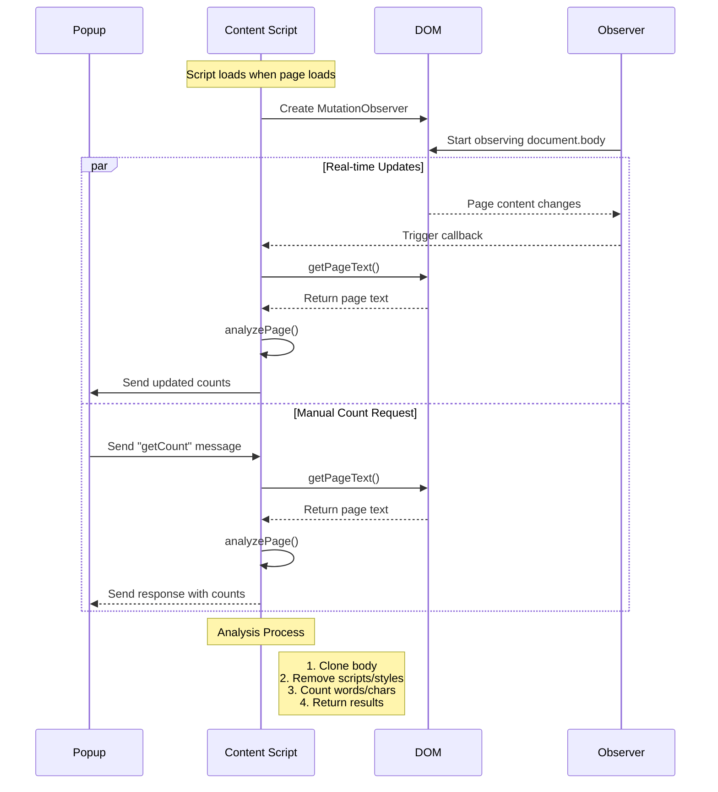

# Page Word Counter Extension

A Chrome extension that counts words and characters on any webpage.

## Features

- Count total words on a page
- Count total characters (with and without spaces)
- Display results in a popup
- Real-time counting when text changes

## Project Structure

```
page-word-counter/
├── manifest.json
├── popup/
│   ├── popup.html
│   ├── popup.css
│   └── popup.js
├── content/
│   └── content.js
└── icons/
    ├── icon16.png
    ├── icon48.png
    └── icon128.png
```

## Step-by-Step Implementation

### 1. Create manifest.json

First, create the manifest file that defines the extension:

```json
{
  "manifest_version": 3,
  "name": "Page Word Counter",
  "version": "1.0",
  "description": "Counts words and characters on any webpage",
  "permissions": ["activeTab"],
  "action": {
    "default_popup": "popup/popup.html",
    "default_icon": {
      "16": "icons/icon16.png",
      "48": "icons/icon48.png",
      "128": "icons/icon128.png"
    }
  },
  "content_scripts": [
    {
      "matches": ["<all_urls>"],
      "js": ["content/content.js"]
    }
  ]
}
```

### 2. Create the Popup Interface

Create `popup.html`, `popup.css`, and `popup.js` with a simple interface to display the counts and a refresh button to update the counts.

- [popup.html](popup/popup.html)
- [popup.css](popup/popup.css)
- [popup.js](popup/popup.js)

### 3. Add Content Script

Create `content.js` to analyze the page content.

[content.js](content/content.js)

#### Sequence Diagram



The diagram shows two main flows:

1. **Real-time Updates**: Using MutationObserver to detect page changes
2. **Manual Requests**: Responding to popup requests for counts

Key Components:

- **Content Script**: Main controller that analyzes the page
- **DOM**: The webpage being analyzed
- **Observer**: Watches for page changes
- **Popup**: Extension interface requesting counts


## Loading the Extension

1. Open Chrome and go to `chrome://extensions/`
2. Enable "Developer mode"
3. Click "Load unpacked"
4. Select the `page-word-counter` directory
