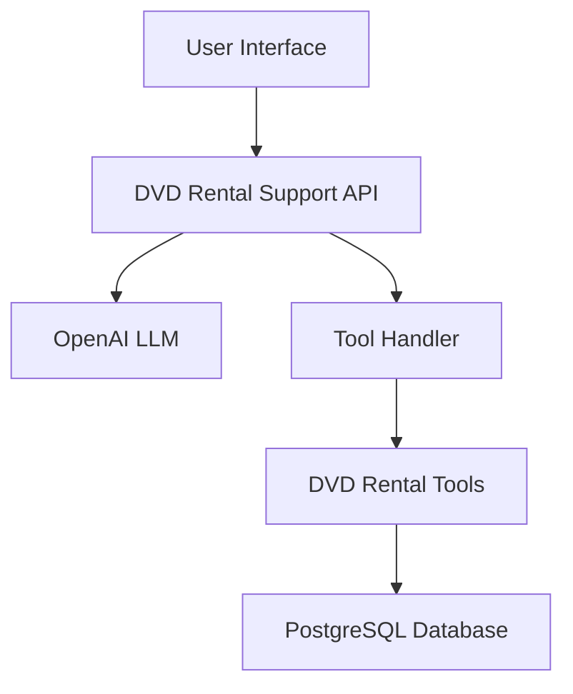
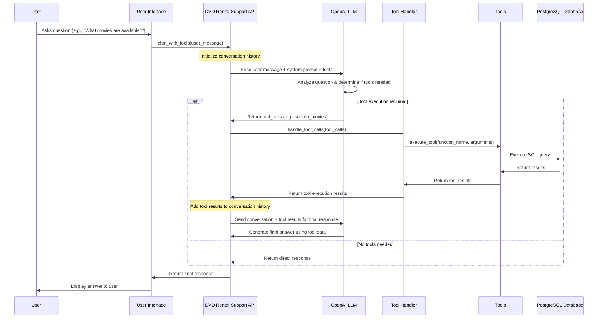
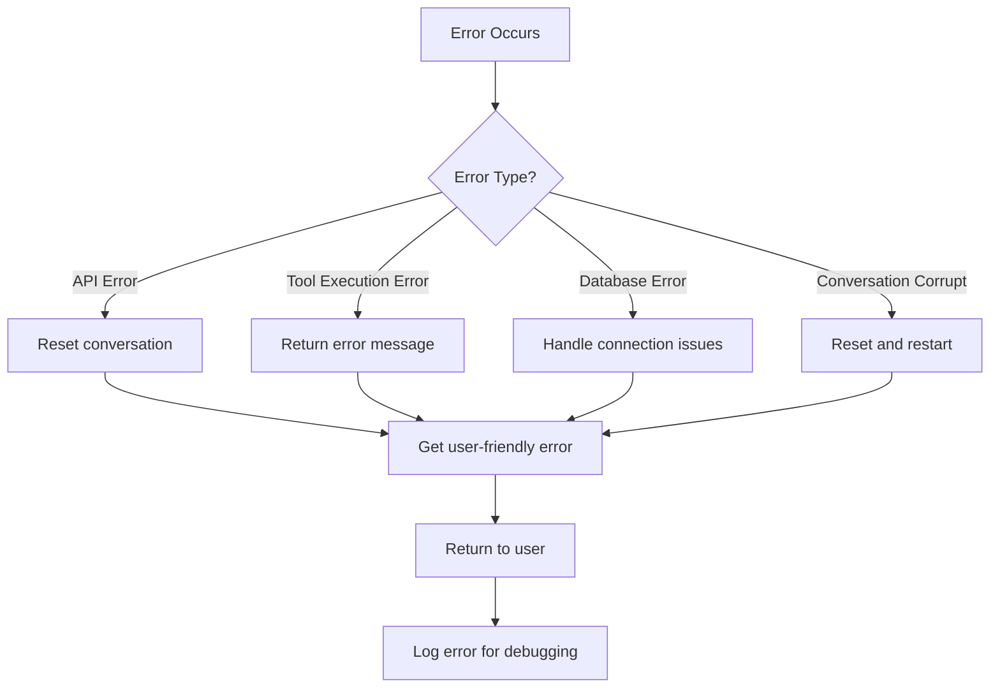

# DVD Rental Support AI - Implementation Flow Diagram

## System Architecture Overview

```mermaid
graph TD

    A[User Interface] --> B[DVD Rental Support API]
    B --> C[OpenAI LLM]
    B --> D[Tool Handler]
    D --> E[DVD Rental Tools]
    E --> F[PostgreSQL Database]
```

## Detailed User Question Flow

```mermaid
sequenceDiagram
    participant U as User
    participant UI as User Interface
    participant API as DVD Rental Support API
    participant LLM as OpenAI LLM
    participant TH as Tool Handler
    participant T as Tools
    participant DB as PostgreSQL Database

    U->>UI: Asks question (e.g., "What movies are available?")
    UI->>API: chat_with_tools(user_message)

    Note over API: Initialize conversation history
    API->>LLM: Send user message + system prompt + tools

    LLM->>LLM: Analyze question & determine if tools needed

    alt Tool execution required
        LLM->>API: Return tool_calls (e.g., search_movies)
        API->>TH: handle_tool_calls(tool_calls)
        TH->>T: execute_tool(function_name, arguments)
        T->>DB: Execute SQL query
        DB->>T: Return results
        T->>TH: Return tool results
        TH->>API: Return tool execution results

        Note over API: Add tool results to conversation history
        API->>LLM: Send conversation + tool results for final response
        LLM->>API: Generate final answer using tool data

    else No tools needed
        LLM->>API: Return direct response
    end

    API->>UI: Return final response
    UI->>U: Display answer to user
```

## Error Handling Flow

```mermaid
flowchart TD
    A[Error Occurs] --> B{Error Type?}

    B -->|API Error| C[Reset conversation]
    B -->|Tool Execution Error| D[Return error message]
    B -->|Database Error| E[Handle connection issues]
    B -->|Conversation Corrupt| F[Reset and restart]

    C --> G[Get user-friendly error]
    D --> G
    E --> G
    F --> G

    G --> H[Return to user]
    H --> I[Log error for debugging]
```
